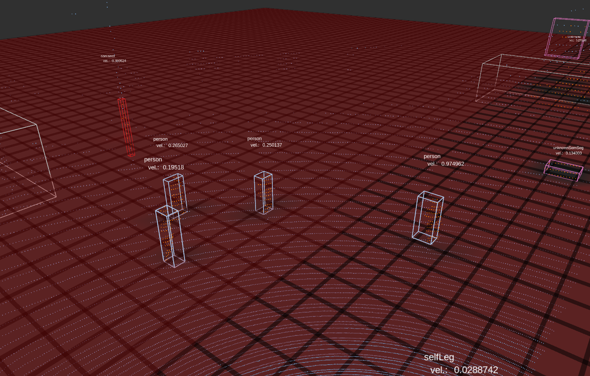
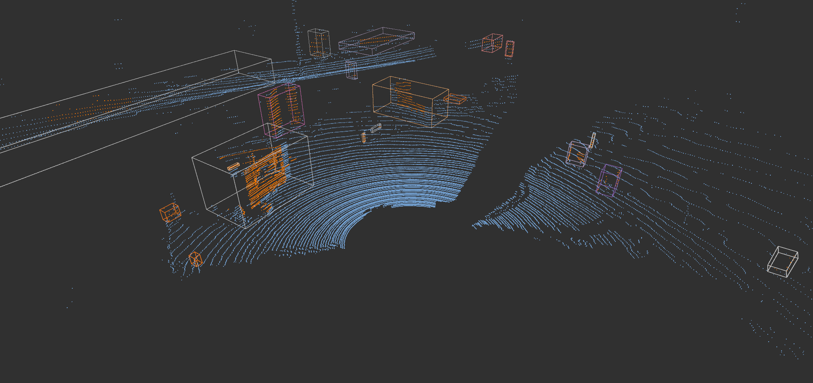

# RSL Dynamic Mapping

RSL Dynamic Mapping is a dedicated ROS package designed for real-time mapping in dynamic environments. It efficiently differentiates between static and dynamic objects, providing a foundational layer for advanced navigation and obstacle avoidance in robotics applications.

## Overview

This package leverages LiDAR data to distinguish and track moving objects within a scene, facilitating the creation of dynamic maps that reflect real-time changes in the environment. It's particularly useful in scenarios where robots interact with both static structures and dynamic entities, such as people or vehicles.

## Gallery

| Dynamic Object Tracking | Static vs. Dynamic Segmentation |
|:-----------------------:|:-------------------------------:|
|  |  |

## Dependencies

To ensure smooth operation of the RSL Dynamic Mapping, the following dependencies must be installed:

### Catkin Packages

- **GridMap**
    - Essential for creating and managing the 2D and 3D maps used in navigation and planning.
      ```bash
      git clone https://github.com/ANYbotics/grid_map.git
      ```

- **Ground Plane Removal**
    - Used for segmenting out the ground plane from LiDAR scans, improving object detection accuracy.
      ```bash
      git clone git@github.com:leggedrobotics/tree_detection.git
      ```

- **FKIE Message Filters**
    - Facilitates efficient message processing within ROS nodes.
      ```bash
      sudo apt install ros-noetic-fkie-message-filters
      ```

## Installation

1. Clone the necessary Catkin packages as listed in the Dependencies section.
2. Place the RSL Dynamic Mapping package in your Catkin workspace.
3. Navigate to your Catkin workspace directory and compile the package using `catkin_make` or `catkin build`.

## License

RSL Dynamic Mapping is released under a the MIT Licence.

## Authorship

This package was authored by Pol Eyschen.